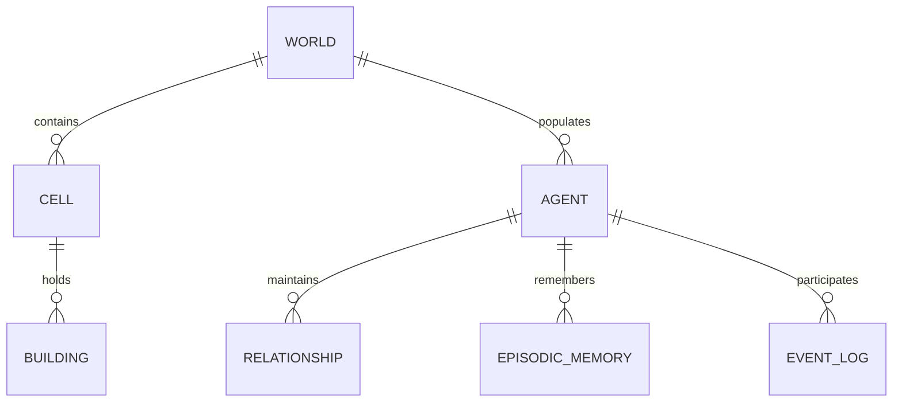

# Database Design Document: AI Civilization Simulator (MVP)

This document details the relational database design for the Minimum Viable Product (MVP) of the **AI Civilization Simulator**. It is designed specifically for **SQLite**, prioritizing minimal disk footprint, simple file-based operations, and read/write performance suitable for entry-level hardware.

---

## 1. Database Architecture & Strategy

To support real-time simulation updates without causing read/write lock bottlenecks on SQLite:

1.  **Hybrid Memory-DB Pattern:** The active simulation runs entirely in-memory using application data structures (Python classes/objects). The database is not queried or updated on every tick for active entities.
2.  **Simulation Save/Restore:** The database is used to serialize and load the world state at startup and shutdown, and periodically as a checkpoint (e.g., every 100 ticks).
3.  **Append-Only History Logs:** The Event system writes to the database in batches using an asynchronous queue, ensuring write operations do not block the main simulation loop thread.
4.  **Write-Ahead Logging (WAL) Mode:** The SQLite connection is configured with `PRAGMA journal_mode=WAL;` to allow concurrent reads while writes are occurring.

---

## 2. Entity-Relationship (ER) Model

The database represents the world layout, active entities, their physical locations, and the historical records of the simulation run.

---

## 3. Table Designs & Structures

### A. Table: `simulation_meta`
Stores system configuration, active status, and world metadata.

| Column | Data Type | Key | Constraints | Description |
| :--- | :--- | :--- | :--- | :--- |
| `id` | INTEGER | Primary | AUTOINCREMENT | Unique ID for the simulation run. |
| `started_at` | TEXT | | NOT NULL | ISO-8601 timestamp of simulation initialization. |
| `current_tick` | INTEGER | | DEFAULT 0 | The current time step of the simulator. |
| `grid_width` | INTEGER | | NOT NULL | Width of the map grid. |
| `grid_height` | INTEGER | | NOT NULL | Height of the map grid. |

### B. Table: `world_cells`
Stores the static terrain layer and resource spawn rules of the grid.

| Column | Data Type | Key | Constraints | Description |
| :--- | :--- | :--- | :--- | :--- |
| `id` | INTEGER | Primary | AUTOINCREMENT | Unique cell index. |
| `x` | INTEGER | | NOT NULL | X-coordinate on the grid (0 to grid_width-1). |
| `y` | INTEGER | | NOT NULL | Y-coordinate on the grid (0 to grid_height-1). |
| `biome_type` | TEXT | | NOT NULL | Terrain type (e.g., `Grassland`, `Mountain`, `Water`). |
| `walkability` | REAL | | NOT NULL | Traversal cost modifier (0.0 to 1.0). |

### C. Table: `resources`
Tracks active resource nodes scattered across the grid.

| Column | Data Type | Key | Constraints | Description |
| :--- | :--- | :--- | :--- | :--- |
| `id` | INTEGER | Primary | AUTOINCREMENT | Unique resource node ID. |
| `cell_id` | INTEGER | Foreign | REFERENCES `world_cells(id)` | Grid cell location. |
| `resource_type` | TEXT | | NOT NULL | Material type (`Food`, `Wood`, `Stone`). |
| `current_amount` | INTEGER | | NOT NULL | Current quantity of resources remaining. |
| `max_capacity` | INTEGER | | NOT NULL | Maximum quantity the node can hold. |
| `regrowth_rate` | REAL | | NOT NULL | Recovery factor per tick. |

### D. Table: `agents`
Tracks active and deceased agents.

| Column | Data Type | Key | Constraints | Description |
| :--- | :--- | :--- | :--- | :--- |
| `id` | INTEGER | Primary | AUTOINCREMENT | Unique agent ID. |
| `name` | TEXT | | NOT NULL | Generated English name. |
| `status` | TEXT | | CHECK (`status` IN ('Active', 'Deceased')) | Current state of the agent. |
| `age` | INTEGER | | DEFAULT 0 | Age in ticks or years. |
| `x` | INTEGER | | NOT NULL | Current X grid coordinate. |
| `y` | INTEGER | | NOT NULL | Current Y grid coordinate. |
| `health` | REAL | | DEFAULT 100.0 | Health meter (0.0 - 100.0). |
| `hunger` | REAL | | DEFAULT 0.0 | Hunger meter (0.0 - 100.0). |
| `energy` | REAL | | DEFAULT 100.0 | Energy meter (0.0 - 100.0). |
| `personality_friendly` | REAL | | NOT NULL | Weight (0.0 to 1.0). |
| `personality_greedy` | REAL | | NOT NULL | Weight (0.0 to 1.0). |
| `personality_aggressive` | REAL | | NOT NULL | Weight (0.0 to 1.0). |
| `personality_curious` | REAL | | NOT NULL | Weight (0.0 to 1.0). |

### E. Table: `relationships`
Stores the bi-directional interpersonal connection parameters.

| Column | Data Type | Key | Constraints | Description |
| :--- | :--- | :--- | :--- | :--- |
| `id` | INTEGER | Primary | AUTOINCREMENT | Unique connection entry ID. |
| `source_agent_id` | INTEGER | Foreign | REFERENCES `agents(id)` | The agent who holds the opinion. |
| `target_agent_id` | INTEGER | Foreign | REFERENCES `agents(id)` | The subject of the opinion. |
| `trust_score` | REAL | | DEFAULT 0.0 | Rating (-100.0 to 100.0). |
| `respect_score` | REAL | | DEFAULT 0.0 | Rating (-100.0 to 100.0). |

### F. Table: `episodic_memories`
Stores the rolling ledger of significant events remembered by agents.

| Column | Data Type | Key | Constraints | Description |
| :--- | :--- | :--- | :--- | :--- |
| `id` | INTEGER | Primary | AUTOINCREMENT | Unique memory ID. |
| `agent_id` | INTEGER | Foreign | REFERENCES `agents(id)` | Owner of the memory. |
| `tick_occurred` | INTEGER | | NOT NULL | The tick index when this occurred. |
| `event_type` | TEXT | | NOT NULL | E.g., `Combat`, `Gather`, `Trade`. |
| `description` | TEXT | | NOT NULL | Narrative representation of the memory. |
| `emotional_charge` | REAL | | NOT NULL | Impact rating (-10.0 to 10.0). |

### G. Table: `buildings`
Tracks structures erected by agents on the grid cells.

| Column | Data Type | Key | Constraints | Description |
| :--- | :--- | :--- | :--- | :--- |
| `id` | INTEGER | Primary | AUTOINCREMENT | Unique building ID. |
| `cell_id` | INTEGER | Foreign | REFERENCES `world_cells(id)` | Location on the map grid. |
| `owner_id` | INTEGER | Foreign | REFERENCES `agents(id)` | The builder/owner of the structure. |
| `building_type` | TEXT | | NOT NULL | E.g., `Shelter`, `Storage`. |
| `integrity` | REAL | | DEFAULT 100.0 | Structural health/decay (0.0 to 100.0). |

### H. Table: `event_log`
Tracks the global history of high-impact events for the chronicle UI.

| Column | Data Type | Key | Constraints | Description |
| :--- | :--- | :--- | :--- | :--- |
| `id` | INTEGER | Primary | AUTOINCREMENT | Unique event log entry. |
| `tick` | INTEGER | | NOT NULL | Time step of occurrence. |
| `event_category` | TEXT | | NOT NULL | E.g., `Settlement`, `Death`, `Conflict`. |
| `description` | TEXT | | NOT NULL | English summary chronicled automatically. |

---

## 4. Query Optimizations & Indexes

Since SQLite uses a simple file locking model, proper indexing is critical to keep search times down during visualization loads.

*   **Spatial Lookup Index:**
    Create a composite index on `world_cells(x, y)` to enable fast sub-region updates and entity collision checks.
*   **Active Agent Query Index:**
    Create an index on `agents(status)` to quickly filter active simulated entities from deceased ones when starting the loop.
*   **Relationship Directory Index:**
    Create a composite index on `relationships(source_agent_id, target_agent_id)` to speed up decision engine utility evaluations.
*   **Episodic Recall Index:**
    Create an index on `episodic_memories(agent_id)` to quickly fetch history segments for the UI Inspector panel.
