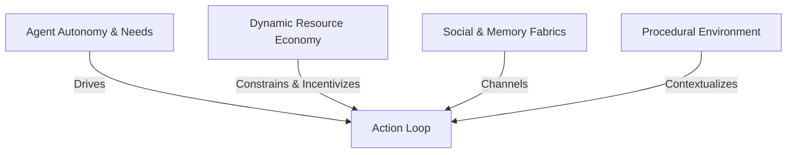

# AI Civilization Simulator: Systems Design & Architecture Analysis

This document provides a comprehensive analysis of the **AI Civilization Simulator**, evaluating the project vision, core systems, potential challenges, and architectural recommendations from the combined perspectives of a Senior Game Designer, AI Simulation Architect, Systems Designer, Product Manager, and Technical Architect.

---

## 1. Project Understanding & Design Philosophy

The **AI Civilization Simulator** is a zero-player simulation game (often categorized as a "watchmaker" simulation or "aquarium" game) focused on the emergent behavior of autonomous agents in a resource-rich, survival-driven world. 

Key attributes of this vision include:
*   **Observational Role:** The user does not interact with, govern, or command the agents. They are an observer looking through a dashboard to see history, trade, conflict, and cooperation unfold in real-time.
*   **Pure Emergence over Optimization:** The objective is **not** to make agents "smart" or optimal pathfinders/planners. Instead, the focus is on **believable, personality-driven behavior** that naturally gives rise to macro-level phenomena.
*   **Failure as a Valid Outcome:** The system does not steer the simulation toward success. The simulator naturally allows, validates, and facilitates a wide range of outcomes, including:
    *   *Civilization Success:* Stable kingdoms with thriving economies.
    *   *Civilization Stagnation:* Camps or villages that fail to progress due to cultural or skill limitations.
    *   *Tribal Fragmentation:* Communities breaking apart into rival clans due to distrust or poor leadership.
    *   *Mass Starvation:* Inefficient agricultural coordination, greed, or hoarding leading to demographic collapse.
    *   *Civil War:* Internal power struggles, rival factions, or resources disputes within a settlement.
    *   *Complete Extinction:* Entire populations dying out due to unchecked violence, starvation, or demographic failure.

---

## 2. What Makes This Project Unique

While simulation games (like *Dwarf Fortress*, *RimWorld*, or *Civilization*) feature complex agent systems, they almost always require direct player agency, resource management, or have hardcoded event loops to drive progression. 

The AI Civilization Simulator is unique because:
*   **Agent-Centric Progression:** Settlement tier upgrades (Camp $\rightarrow$ Kingdom) are not bought with a button click. They manifest when agents *decide* to cluster their buildings, declare boundaries, establish safety structures, or yield authority to a leader.
*   **Dynamic History Generation:** Instead of static logs, the history system reads the physical and social state changes in the world and compiles them into a narrative history of the world (e.g., "Year 25: The Famine of the North").
*   **High-Fidelity Individual Profiles:** By tracking memory, personality, and relationships, the game turns nameless entities into characters with unique motivations, enabling the observer to follow individual stories within a macroeconomic scale.

---

## 3. Core Simulation Pillars

To achieve genuine emergence, the simulator must rest on four fundamental pillars:

1.  **Agent Autonomy & Needs:** Agents operate on an internal loop driven by survival needs (hunger, energy, health) filtered through personality traits (e.g., greedy vs. loyal).
2.  **Dynamic Resource Economy:** Resources must have physical utility. Wood and stone are not abstract numbers; they must be physically collected, stored, traded, and consumed to build shelter or tools.
3.  **Social & Memory Fabrics:** Relationships are dynamic. A betrayal during a trade is remembered, affecting future interactions and potentially cascading into inter-group rivalry or war.
4.  **Procedural Environment:** The geography (mountains acting as barriers, rivers as trade routes, forests as lumber sources) shapes the path of least resistance for settlement locations and resource conflicts.

---

## 4. Major Systems Involved

To implement the simulator, we require several highly decoupled systems:

### A. The Agent Decision Engine (Utility-Based)
*   **Utility Theory Decision Making:** Instead of solving for optimal pathfinding or game-theoretic wins, agents calculate utility based on *flawed, personality-driven heuristics*. A "cowardly" agent might flee a minor fight even if it has an advantage, while a "greedy" agent might hoard food to its own long-term detriment.
*   **Personality Vector:** A set of normalized weights (e.g., `Friendly: 0.8`, `Greedy: 0.2`) that dynamically scale utility calculations.

### B. Memory & Relationship Database
*   **Episodic Memory:** Short logs of events with timestamps, locations, participants, and emotional weight (e.g., "Attacked by John at (12, 45) - Severity: High").
*   **Relationship Graph:** A network representing social links. Nodes are agents; edges have values for trust, respect, and familial association.

### C. Procedural World & Navigation System
*   **Terrain Generator:** Perlin/Simplex noise to generate heightmaps, resource nodes, water bodies, and biomes.
*   **A* Pathfinding & Influence Mapping:** Agents need to find paths across changing terrain. Influence mapping allows the simulation to track "danger zones," "settlement boundaries," and "high-yield resource zones" dynamically.

### D. Emergent Economy (Market Engine)
*   **Double-Auction Market:** Agents with excess supply list items for sale; agents with needs list buy orders. Prices adjust naturally based on supply and demand.
*   **Currency:** Starts with direct bartering (food for wood), evolving into a standardized medium of exchange (gold) as trust and trade frequency increase.

### E. Settlement & Building Manager
*   **Spatial Clustering (DBScan/K-Means):** Algorithms to automatically identify when a group of agents are sleeping, working, and building in close proximity, dynamically grouping them into a "Settlement" entity.
*   **Dynamic Infrastructure:** Agents lay down paths based on high-traffic walk routes, which gradually turn into roads.

### F. Narrative & History Engine
*   **Event Summarization:** An observer module that listens for high-impact state changes (e.g., death of a leader, creation of a town, onset of winter with low food stocks) and translates them into semantic history records.

---

## 5. Potential Challenges

| Challenge Area | Description | Impact | Mitigation Strategy |
| :--- | :--- | :--- | :--- |
| **Performance Scale** | Running hundreds of utility-calculating agents, pathfinding, and dynamic economic transactions in a web browser can quickly lead to lag. | High | Use Web Workers for off-loading simulation calculations; implement tick-rate throttling for non-essential systems (e.g., economy ticks every 10 frames instead of every frame). |
| **Flawed Decision Deadlocks** | Agents making sub-optimal choices (e.g., refusing to trade with a rival despite starving) could lead to rapid extinction before any progression is observed. | Critical | Fine-tune the inflection point where sheer biological survival needs override complex social dynamics (e.g., a starving agent will accept food from an enemy, even if it degrades their pride). |
| **Boring Emergence** | The simulation stabilizes too quickly, leading to agents standing around doing nothing once basic needs are met. | Medium | Introduce soft environmental cycles (seasons, resource depletion, aging, natural disasters) to constantly disrupt equilibrium. |
| **Cognitive Load on Visuals** | Representing thousands of actions clearly on a website dashboard without cluttering. | Medium | Use a clean, modular UI with filters (e.g., view economic heatmaps, relationship lines, or historical timelines separately). |

---

## 6. Potential Opportunities

*   **Generative AI Integration (Optional):** We can use local/lightweight LLMs (or pre-authored template expansion systems) to turn agent memories and actions into rich, readable journal entries when clicked.
*   **Highly Shareable "Emergent Stories":** Because the simulator creates unique histories, users can easily share seed values or civilization timelines, generating community engagement.
*   **Scientific Simulation Visualizer:** The codebase can serve as a lightweight model for studying sociological concepts like trust, division of labor, and resource distribution.

---

## 7. Feasibility Assessment

**Is the vision realistic?** 

**Yes**, specifically because the goal is *believable behavior over optimal behavior*. Believable but flawed behavior is significantly easier to compute than mathematically optimal pathfinding and economic game theory. By allowing agents to make irrational choices based on their personalities (e.g. hoarding food until it rots, starting fights they can't win), we bypass the need for expensive optimization calculations.

---

## 8. Suggestions to Refine the Vision for Natural Collapse

To ensure that failure states emerge naturally and feel earned, we suggest these structural parameters:

1.  **Friction-Based Systems (Inefficiency):**
    If trade and movement have zero cost, civilizations will never fragment. We should introduce friction: moving goods over mountains consumes more hunger/energy; trading with distant agents incurs higher transaction costs. This naturally causes groups to split into distinct localized tribes.
2.  **Personality Inheritance and Genetic Drift:**
    When agents form families and have children, the children should inherit a mix of parental personality traits with a slight mutation factor. If a peaceful town gets populated by highly aggressive descendants, a civil war or societal fragmentation will occur organically over generations.
3.  **Hoarding & Greed Mechanics:**
    If greedy agents do not share or trade food during a winter phase, they will survive while others starve. However, this raises the hostility and desperation of the starving agents, naturally triggering resource wars or theft.
4.  **No Safety Nets:**
    The environment must be uncaring. If a disease spreads, or a drought ruins crops, and the agents fail to build silos or develop medicine, they will die. Complete extinction should be a real, unmitigated threat.

