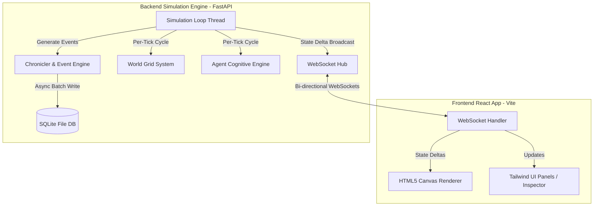
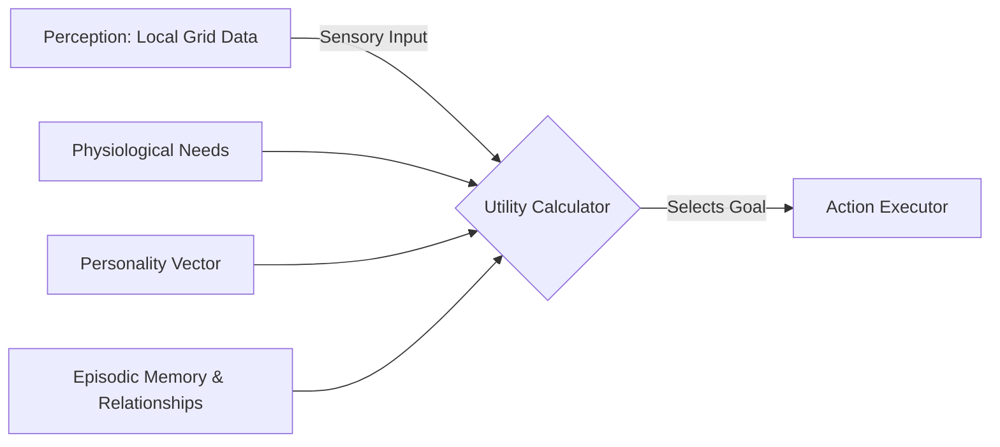
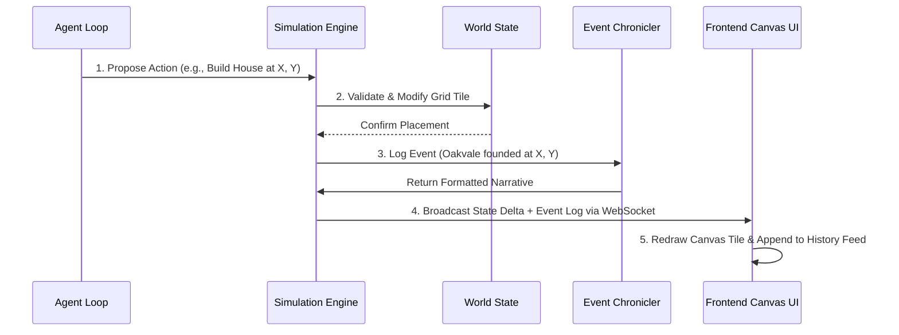

# System Design Document: AI Civilization Simulator

This document establishes the architecture, systems design, and data structures required to build the **AI Civilization Simulator**. It is tailored for a solo developer/first-year CS student using a Python (FastAPI) and React (Vite) stack, optimized to run efficiently on entry-level hardware (Ryzen 3 3200G, 8GB RAM).

---

## 1. High-Level Architecture

The simulator follows a **Client-Server Architecture** utilizing a decoupled **State-Update Loop** model. Rather than rendering the simulation frame-by-frame on the backend, the backend acts as a headless simulation engine that broadcasts state deltas over WebSockets. The frontend is a dumb-rendering client that visualizes the state and manages inspectable UI views.



---

## 2. Simulation Engine Design

The engine runs as a fixed-rate tick loop decoupled from the HTTP server threads.

### The Tick Cycle Flow
A single simulation tick follows a sequential pipeline to prevent race conditions and ensure state consistency:

```
[Start Tick] 
   │
   ├── 1. Environmental Decay & Growth (World System)
   │      - Resource nodes update regrowth timers.
   │      - Wild food decays if left unharvested.
   │
   ├── 2. Biological Degradation (Agent System)
   │      - Need meters increment (Hunger, Energy).
   │      - Health updates based on needs.
   │
   ├── 3. Perception Stage
   │      - Agents read local grid cells (resources, other agents).
   │
   ├── 4. Decision Stage
   │      - Agents run utility heuristics to choose actions.
   │
   ├── 5. Execution Stage
   │      - Actions resolve (harvest, move, trade, combat).
   │      - Conflict resolution occurs here.
   │
   ├── 6. Macro Clustering & Economic Tick
   │      - DBSCAN runs to update settlement boundaries.
   │      - Market orders match and clear.
   │
   ├── 7. Event & Chronicle Processing
   │      - Write state deltas to memory buffer.
   │      - Publish narrative log events if triggers met.
   │
   └── 8. State Broadcast
          - Package world state deltas and send via WebSocket.
[End Tick]
```

To accommodate low-end hardware, the loop supports a variable tick delay (default: 500ms per tick) and runs asynchronously using Python’s `asyncio` loop.

---

## 3. World System Architecture

The environment is represented as a spatial grid optimized for memory footprint and quick neighbor queries.

### A. World Grid & Terrain Representation
*   **Grid Coordinate System:** A 2D array of grid cells. Each cell contains metadata: `[BiomeType, Elevation, WalkabilityFactor]`.
*   **Layer Separation:** The world state maintains three independent arrays to minimize lock contention:
    1.  *Static Terrain Layer:* Fixed data generated at startup (Grass, Mountain, Water).
    2.  *Dynamic Entity Layer:* Paths, buildings, and roads.
    3.  *Resource Overlay:* Food, wood, stone, metal, and gold density indices.

### B. Settlements & Infrastructure Management
*   **Dynamic Spatial Clustering:** A lightweight spatial clustering algorithm runs every N ticks. It groups adjacent player-built structures (homes, farms, warehouses) and designates the bounded grid cells as a named **Settlement**.
*   **Infrastructure Growth:** Road overlays are placed dynamically on tiles that experience high agent traversal frequencies. As the path density index rises, the tile's traversal cost decreases, prompting agents to naturally prefer walking along roads.

---

## 4. Agent System Architecture

Agents are model-driven actors operating on a sensory-cognitive-action loop.



### A. Attributes & Drivers
*   **Physiological Needs:** Hunger, Energy, and Health decay at constant rates. If hunger passes a threshold, the utility score for gathering/eating food increases exponentially, overriding social/personality behaviors.
*   **Personality Vector:** Fixed weights assigned at birth (`Friendly`, `Greedy`, `Aggressive`, `Curious`, `Loyal`, `Lazy`). These act as scaling coefficients in the utility logic.
*   **Cognitive Utility Heuristic:** Goals are scored using utility equations:
    $$\text{Utility} = f(\text{Need}) \times \text{PersonalityWeight} + \text{MemoryBias}$$
    An agent chooses the action sequence associated with the highest utility score.

### B. Memory & Relationships
*   **Episodic Memory Buffer:** A rolling ring-buffer holding a maximum of 20 high-priority memory nodes (to prevent RAM growth). Memory nodes store experiences with other agents (e.g., successful trade, theft, combat).
*   **Relationship Graph:** A sparse map containing trust and respect values for known agents. When an interaction occurs, trust/respect updates, shifting future goal utilities (e.g., high trust increases trade utility; low trust increases combat/theft utility).

---

## 5. Emergent Systems Architecture

Macro societal outcomes emerge strictly from the aggregate behaviors of the individual agent cognitive loops:

*   **Economy & Trade:** Agents with surplus resources list them on a global double-auction market. Greedy agents will price gouge during scarcities. If a buyer is starving, their food-utility will spike, forcing them to buy at exorbitant rates or attempt theft, naturally generating market spikes, famines, and crime rates.
*   **Settlement Growth:** When agents sleep in close proximity (to satisfy safety and comfort needs), they build shelters. As shelters cluster, the settlement engine automatically registers a new town, unlocking collective resource pools.
*   **Leadership & Factions:** Agents with high `Leadership` and `Respect` scores in the relationship graph begin to influence the goals of neighboring agents. If two leaders emerge within a town with opposing relationship histories, they will form distinct factions, leading to territorial division or civil war.

---

## 6. Event & History System

To avoid writing massive logs to disk, the history system uses a **Filter-and-Translate Pipeline**:

```
[Raw Engine State Changes] ──► [Event Filter (Threshold Check)] ──► [Chronicle Generator] ──► [SQLite DB]
```

1.  **Event Generation:** The engine monitors key thresholds (e.g., an agent dying, a settlement forming, a resources market crash, a combat engagement).
2.  **Episodic Chronicler:** When an event passes the filter, it is converted into a structured history entry: `[TickNumber, EventType, Description, AffectedEntities]`.
3.  **Narrative Engine:** A simple template system translates event nodes into readable stories (e.g., *"Year 12, Tick 450: The settlement of Oakvale fractured due to the rivalry between John and Arthur"*).

---

## 7. Dashboard Architecture

The dashboard visualizes the simulation without degrading backend performance:

*   **HTML5 Canvas Render Engine:** The frontend uses an HTML5 Canvas to draw the world grid, resources, and agents. Using Canvas instead of individual DOM elements ensures smooth rendering of hundreds of active elements on low-end integrated graphics (Vega 3/8).
*   **Inspectors:** Selecting an agent stops WebSocket state polling for that specific agent’s details and focuses on their unique local state data (relationships, memory timeline, and needs).
*   **Analytics Dashboard:** Displays real-time charts plotting demographic curves (living agents vs. dead agents), wealth distribution (Gini coefficient), and aggregate food levels.

---

## 8. Data Flow Design

This diagram represents how an agent's internal state cycles through the engine and propagates to the user's dashboard:



---

## 9. Performance Strategy (Target Stack Optimization)

To run the simulation smoothly on a **Ryzen 3 3200G (4 cores, 4 threads, Vega 8) with 8GB RAM**, we apply strict optimization boundaries:

### A. State Synchronization & WebSockets
*   **State Deltas Only:** The server does not send the entire world state every tick. It only broadcasts *deltas* (changed tiles, active agent positions, new structures).
*   **JSON Compression:** Data packets are serialized into highly compressed JSON arrays rather than verbose objects (e.g., sending `[12, 45, 1]` instead of `{"x": 12, "y": 45, "entity_type": "farm"}`).

### B. Memory Boundaries
*   **Ring-Buffered Memory:** Agents forget older memories. A hard cap of 20 memories per agent prevents memory leaks over long execution times.
*   **Garbage Collection:** Dead agents are purged from active memory and written directly to the SQLite history table. They are no longer simulated.

### C. Execution Offloading
*   **Non-Blocking Loops:** Heavy operations (DBSCAN clustering, pathfinding calculation, database writes) run asynchronously using Python's `asyncio` thread executors, preventing UI stuttering.

---

## 10. MVP Architecture

The MVP focuses exclusively on survival, basic gathering, and visualization:

*   **Essential Engine:** A 50x50 world grid supporting grass, forest, and food resource nodes.
*   **Essential Agents:** Maximum 30 agents with three needs (Hunger, Energy, Health) and two basic actions (Gather Food, Sleep).
*   **Essential Social:** Basic relationship matrix tracking trust to allow bartering.
*   **Essential Dashboard:** A simple flat 2D Canvas viewport showing green tiles (grass), brown tiles (camps), red dots (agents), and a rolling text history panel.

---

## 11. Future Scalability Plan

The architectural design remains adaptable for future features without requiring a full rewrite:

*   **Technology & Religion Integration:** These can be modeled as global "Settlement Traits" managed by the settlement engine, modifying the utility equations of all member agents in that cluster (e.g., discovering "Agriculture" modifies the Farming skill coefficient).
*   **Multi-Agent Guilds:** If scaling to higher populations, we can group agents into "Factions" that share a single cognitive utility planner, resolving actions for the group collectively to reduce CPU calculations.
*   **Scale-Out Database Migration:** SQLite can be swapped for PostgreSQL by editing the FastAPI SQLAlchemy configuration, allowing long-term, multi-simulation history storage.

---

## 12. Risks & Technical Challenges

| Risk | Cause | Mitigation Strategy |
| :--- | :--- | :--- |
| **Cascade Extinction (Deadlock)** | All agents starve in the first 10 minutes because farming skills start too low. | Implement a "Wild Harvest Fallback" where wild berries spawn in forests and do not require farming skills to gather. |
| **CPU Starvation on Pathfinding** | 60 agents recalculating A* paths on a 100x100 grid simultaneously every tick. | Use path-caching and vector navigation maps for group movements (e.g., agents follow the same road vector instead of recalculating individual paths). |
| **Infinite History Database Growth** | The SQLite database grows to gigabytes over 24 hours of simulation. | Set up a background worker that prunes events older than 5,000 ticks, leaving only major settlement milestones. |
| **WebSocket Congestion** | High network latency on local loops due to large state packet sizes. | Throttle client visual updates. The engine calculates at 2 ticks/sec, sending updates only twice a second. |
